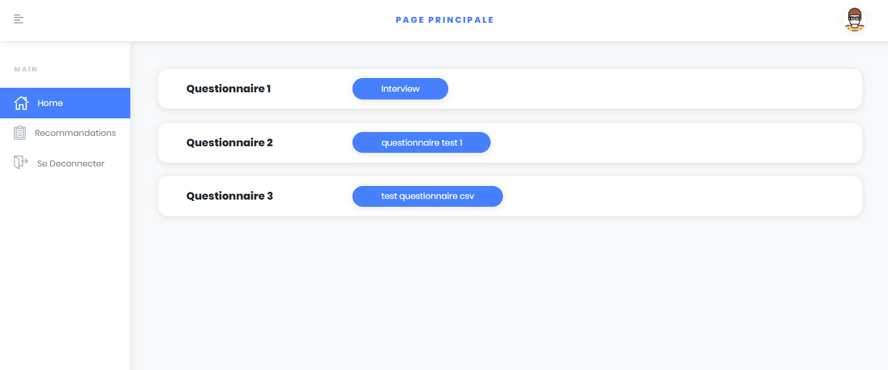
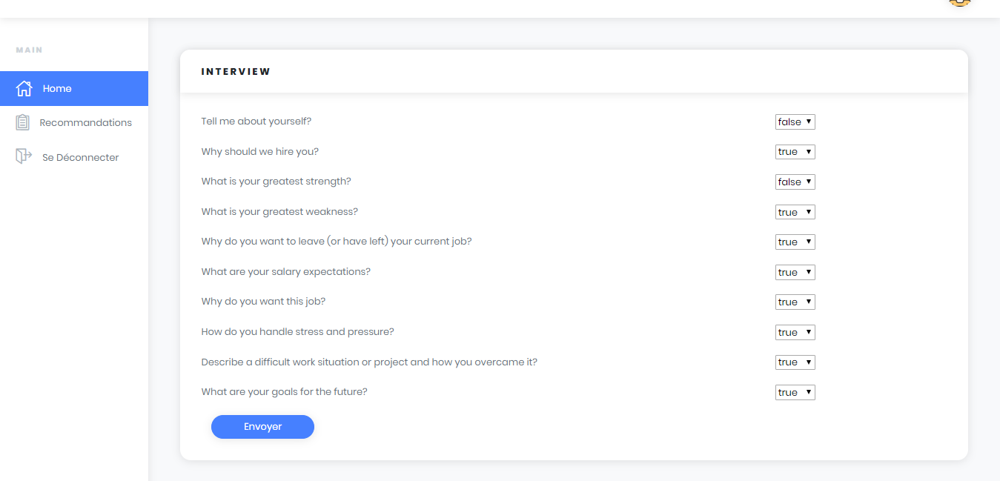
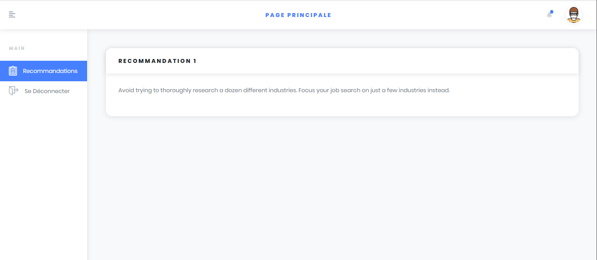

CTO recommendations for developers using machine learning 
========

The project will solve the problem of asking the CTO for a problem and waiting for him to answer you,
Our project will provide answers, after answering a simple quiz.

Look how easy it is to use:

   
   
   
   
   
   
   

Features
--------

- Friendly user interface
- Fast
- Efficient

Installation
------------
-  Java EE
- Bootstrap
- Tomcat server

Contribute
----------

Support
-------

If you are having issues, please let us know.

License
-------

